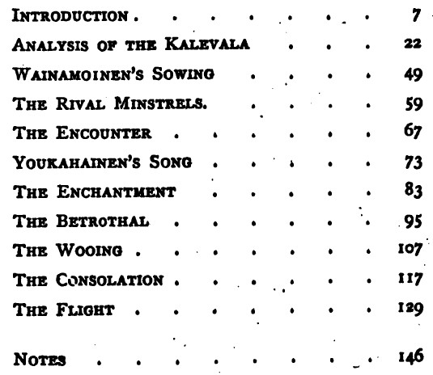

# KALEVALA26

### 1868

---

**PORTER John Addison, 1868, *Selections From the Kalevala: Translated from a German Version*, New York: Leypoldt & Holt.**

```
PORTER John Addison, 1868, Selections From the Kalevala: Translated from a German Version, New York: Leypoldt & Holt.
```

Porter 1868, p: v.

[S]elections [...] made by the late Professor Porter, after a long familiarity with the work, as forming the most interesting narrative, or episode, which it contains, and as being sufficient, without wearying the reader with uninteresting mythological details, and monotonous repetition, to give a just idea of the matter and manner of the poem.

Porter 1868, p: vi.

The introduction and analysis of the poem have been prepared by a competent scholar, and will be found to contain valuable information on subjects which heretofore have hardly received just attention from American writers. Not having been able to learn that any other English translation from the great national epic of the Finns has ever appeared, the publishers present this one with special confidence in its claims upon the attention of all cultivated readers.



Their [Finns'] literature, and especially their popular poetry, show a high intellectual development, even in a very distant time - so far back indeed as to belong almost to the mythical period.

Porter 1868, p: 7.

Their anger is slow and quiet, their speech earnest, and their faith always pledged by their words. The Finn believes, as no one else does, in the power of words, and with him words disposed in a song have a magical influence. The belief in magic has always had a strong hold on him, and even now in the country districts, incantations and charms are still used in spite of a belief in Christianity and the penalties of the law.

Porter 1868, p: 8.

---